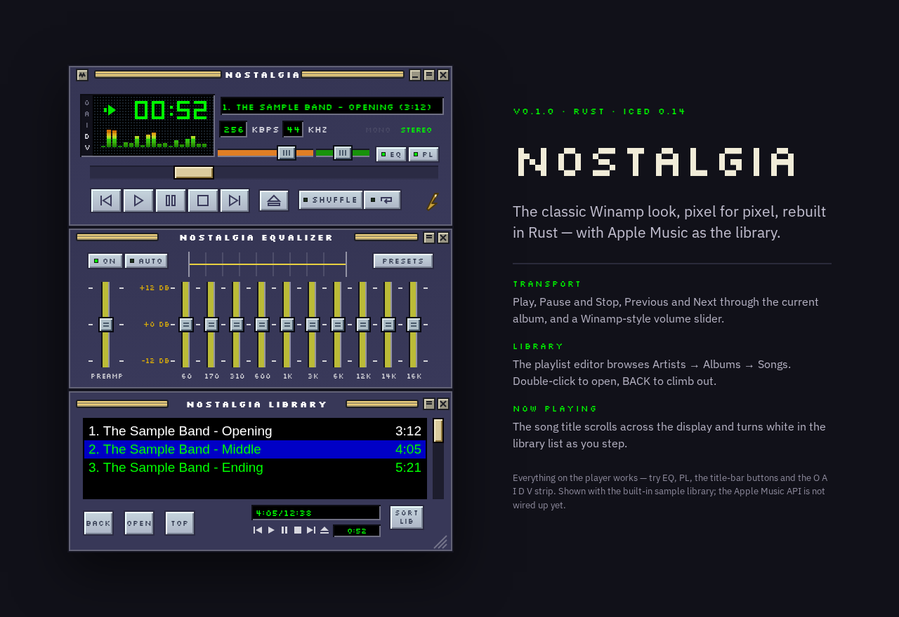
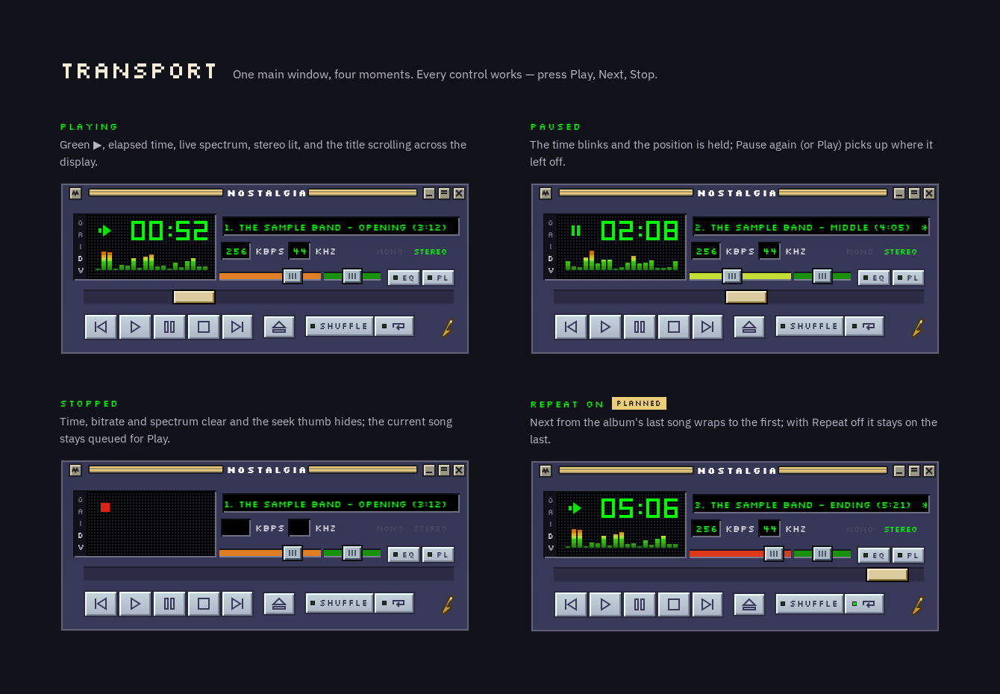
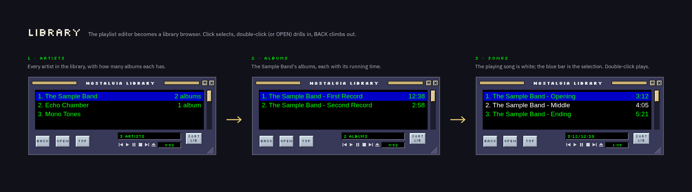
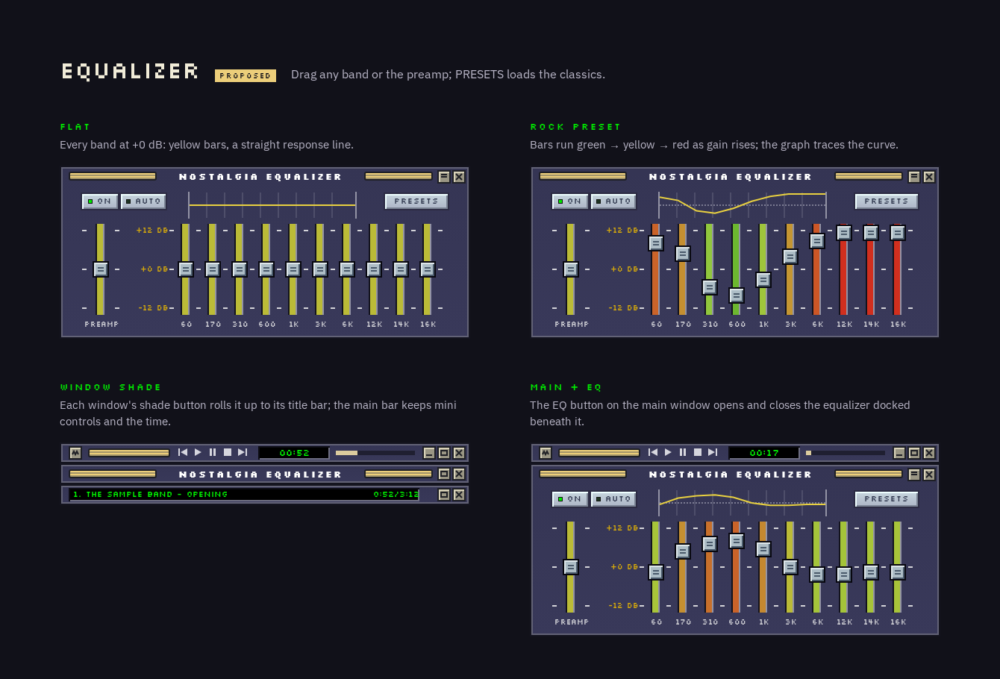

# nostalgia

A (very close if not pixel-perfect) clone of the classic Winamp UI, built in Rust, using Apple
Music as the music library.

## Initial prompt

<!-- tumwater:prompt:start -->
Nostalgia is a (very close if not pixel-perfect) clone of the classic Winamp UI, but built in Rust, and using Apple Music as the music library.
<!-- tumwater:prompt:end -->

## Status

<!-- tumwater:status:start -->
Early skeleton (0.1.0): an iced (0.14) desktop shell themed with a Winamp 2.x base-skin palette —
a raised title bar (always-on-top, shade, minimize, close), a Now Playing LCD bar
showing the current track's artist, title, and length, chrome transport controls with Repeat and
Shuffle, volume and balance sliders, an equalizer panel with a preset pick list, and an artist →
album → song browser whose song rows show each track's length. A MusicKit loopback sign-in runs
at startup when `APPLE_MUSIC_DEVELOPER_TOKEN` is set: browse queries read the signed-in Apple
Music library through the REST API, following `next` pages for large libraries, and fall back
to the in-memory sample library otherwise. Playback plays the selected song's Apple Music preview
through `rodio`, behind an injectable audio-output seam that falls back to silence when no output
device opens; Pause and Stop still only update UI state. Open work lives in PLANS.md, BUGS.md,
and QUESTIONS.md.
<!-- tumwater:status:end -->

## Screenshots

Design mockups of the look Nostalgia is aiming for, matched against the classic Winamp 2.x base
skin and shown with the built-in sample library. The running app builds the transport controls
(Repeat included), the equalizer panel (preset curves included), and window-shade mode.

Transport states — playing, paused, stopped, and Repeat on:

The playlist editor as a library browser, drilling from Artists to Albums to Songs:

The equalizer with presets, plus window-shade mode:

The player on its own: [docs/screenshots/player.png](docs/screenshots/player.png).

## Usage

Build and run with `cargo run`; the player opens an iced window showing the Now Playing bar (the
playing track's artist and title, with its length at the right), the
Play/Pause/Stop/Previous/Next controls, Repeat and Shuffle toggles, volume and balance sliders,
an equalizer panel (an EQ on/off button, a preset pick list, a preamp slider, and ten band
sliders), and a browse list whose song rows show each track's length. The title bar's `A` button
toggles always-on-top, its shade button (or a double-click on the bar) rolls the window up to
just that title bar and back, and its `–` and `✕` buttons minimize and close. With the window
focused, the classic Winamp keys drive
playback: Z and B step back and forward, X plays, C pauses, V stops, and the up/down arrows nudge
the volume. Setting `APPLE_MUSIC_DEVELOPER_TOKEN` at launch starts a browser-based MusicKit
sign-in: browse queries then read your Apple Music library through the REST API, and fall back to
the built-in sample library when it is unset. Playback plays the selected song's Apple Music
preview through `rodio` when the library supplies one, and updates the UI state either way; the
Pause and Stop controls still only change that UI state, so they do not silence the preview yet.
There are no CLI flags or config files yet.

## Development

`make check` runs the whole landing gate in one command — `cargo fmt --check`, `cargo clippy --all-targets -- -D warnings`, a `cargo doc` build that fails on any rustdoc warning, and the test suite — and is the fastest way to see whether a change is merge-ready. The individual stages are available separately (`make fmt`, `make lint`,
`make docs`, `make test`); `make fix` applies formatting and clippy's
machine-applicable fixes in place, and `make run` is the same as `cargo run`.
